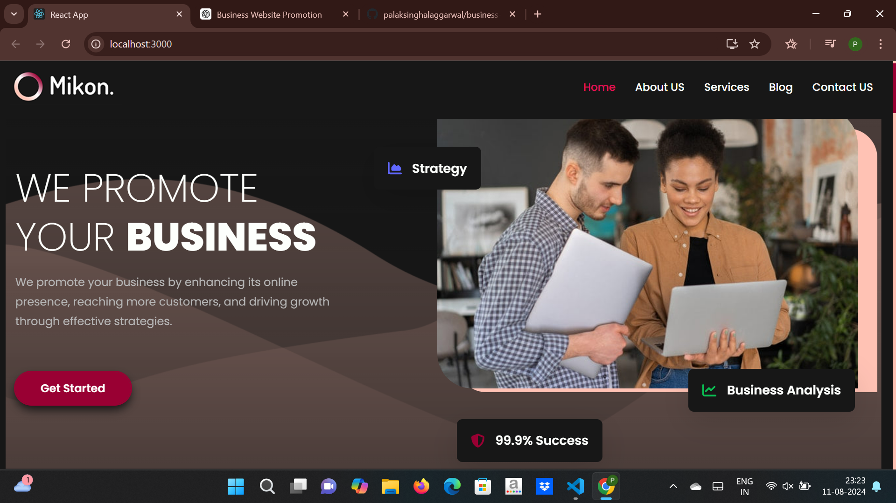
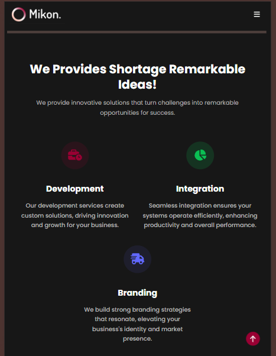
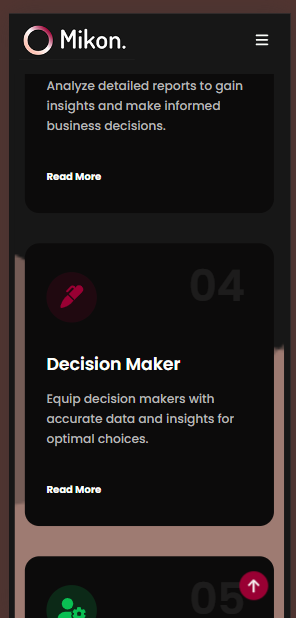
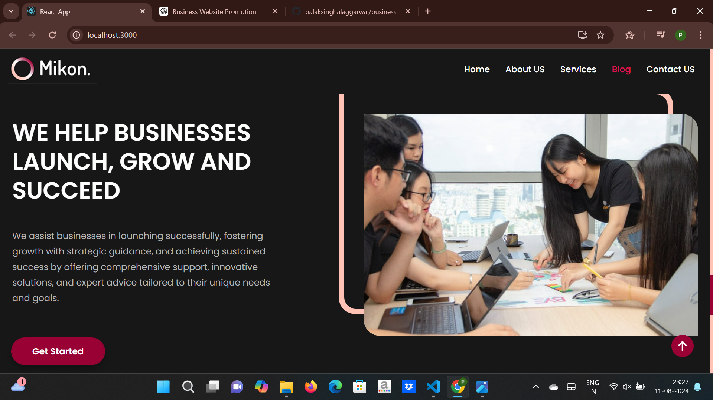
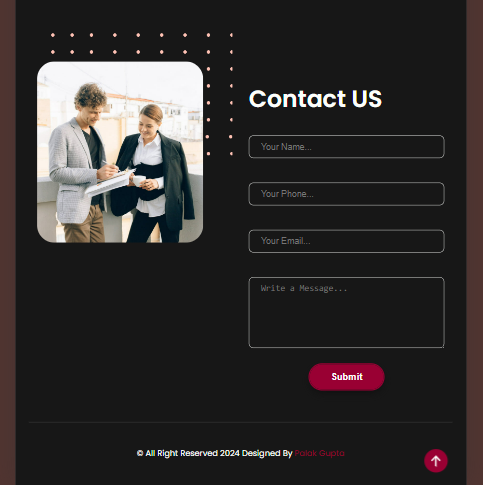

# A Business Website using React JS & nested CSS selector

## Introduction

This project is a frontend application developed using React.js and styled with nested CSS selectors. It demonstrates modern web development practices and showcases a clean, responsive design.

## Features

- **React.js**: Utilized for building dynamic user interfaces.
- **Nested CSS Selectors**: Employed for advanced styling and layout management.
- **Responsive Design**: Ensures the application looks great on all devices.

## Screenshots

### Homepage



### About 



### Services



### Blog



### Contact 



## Installation

1. **Clone the repository:**

   ```bash
   git clone https://github.com/palaksinghalaggarwal/your-repository.git

    cd your-repository

    npm install 

    npm start

    http://localhost:3000

    ## Usage

- Browse through the different sections to explore the offerings.
- Customize the design or content as per your requirements.

## Contributing

Contributions are welcome! If you have suggestions or improvements, feel free to open an issue or submit a pull request.

## License

This project is open-source and available under the [MIT License](LICENSE).
    

